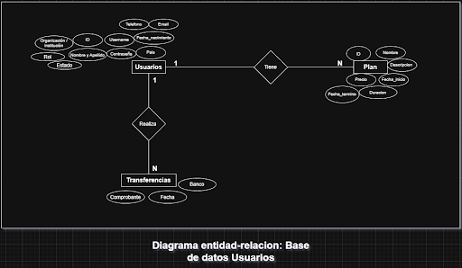
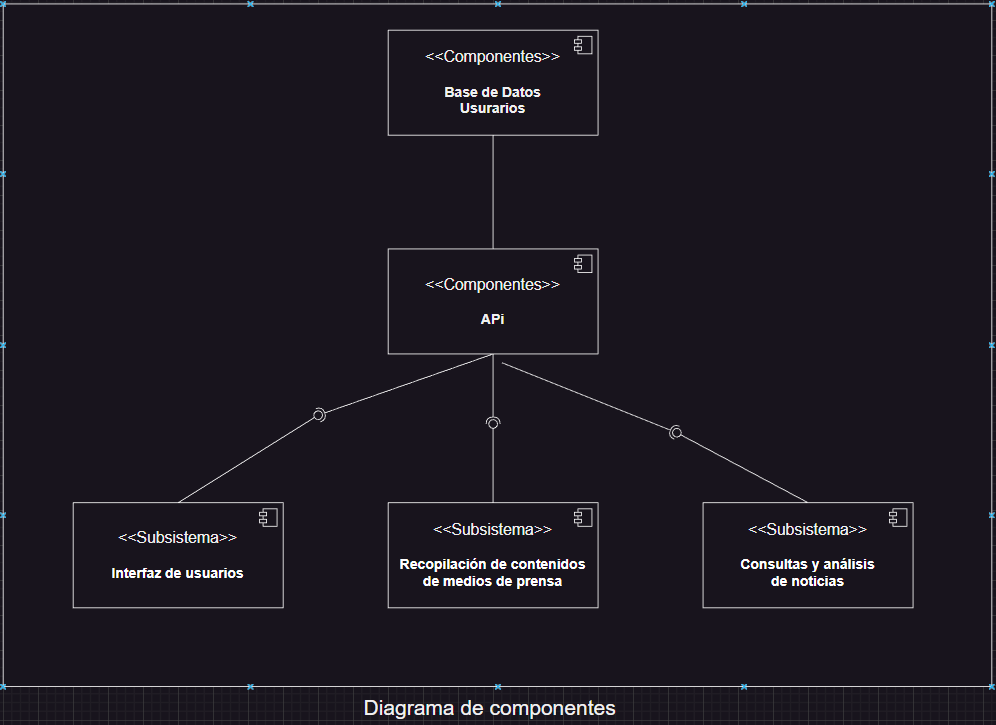

# Arquitectura del subsistema user-subscription-manager

Interfaz de gestión de usuarios y suscripciones para la plataforma de noticias, encargada del control de cuentas, roles, accesos, planes de suscripción y pagos.  
Este subsistema se integra con los demás módulos del ecosistema SophiaSearch-2025 para asegurar una administración centralizada y segura de los usuarios.

- **Versión actual:** v0.1 (Prototipo funcional)  
- **Versión de diseño:** v1.0 (Versión con sistema de pagos y reportes automáticos)

---

## 1. Arquitectura actual 

#### Diagrama 1. Base de datos de usuarios  
Este diagrama representa la estructura de la base de datos que se ocupara para almacenar toda la informacion de los usuarios



#### Diagrama 2. Organización del repositorio  

Esta es la vista de Desarrollo 

```
user-subscription-manager/
│
├── 📂 src/                          # Código fuente de la aplicación
│   ├── 📂 api/                      # Rutas de la API REST
│   │   ├── auth.routes.js           # Rutas de autenticación
│   │   ├── user.routes.js           # Rutas de usuarios
│   │   ├── subscription.routes.js   # Rutas de suscripciones
│   │   ├── payment.routes.js        # Rutas de pagos
│   │   ├── scheduler.routes.js      # Rutas de tareas programadas
│   │   └── index.js                 # Enrutador principal
│   │
│   ├── 📂 controllers/              # Lógica de negocio
│   │   ├── auth.controller.js       # Control de autenticación
│   │   ├── user.controller.js       # Control de usuarios
│   │   ├── subscription.controller.js  # Control de suscripciones
│   │   └── payment.controller.js    # Control de pagos
│   │
│   ├── 📂 services/                 # Servicios reutilizables
│   │   ├── email.service.js         # 📧 Envío de emails (Gmail/SendGrid)
│   │   ├── notification.service.js  # 🔔 Sistema de notificaciones
│   │   ├── scheduler.service.js     # ⏰ Tareas programadas
│   │   ├── payment.service.js       # 💳 Procesamiento de pagos (Stripe)
│   │   └── security.service.js      # 🔒 Seguridad y validaciones
│   │
│   ├── 📂 models/                   # Modelos de datos
│   │   ├── User.js                  # Modelo de usuario
│   │   ├── Subscription.js          # Modelo de suscripción
│   │   └── Payment.js               # Modelo de pago
│   │
│   ├── 📂 middlewares/              # Middlewares de Express
│   │   ├── auth.middleware.js       # Verificación de autenticación
│   │   └── role.middleware.js       # Verificación de roles
│   │
│   ├── 📂 config/                   # Configuraciones
│   │   ├── firebase.js              # Configuración de Firebase
│   │   └── stripe.js                # Configuración de Stripe
│   │
│   ├── 📂 scripts/                  # Scripts de utilidad
│   │   ├── seed.js                  # 🌱 Poblar BD con datos de prueba
│   │   ├── test-notifications.js    # 📬 Probar sistema de notificaciones
│   │   ├── test-firestore.js        # 🔥 Probar conexión a Firestore
│   │   ├── backup.js                # 💾 Backup de base de datos
│   │   └── example-data.js          # 📝 Datos de ejemplo
│   │
│   ├── 📂 tests/                    # Tests unitarios e integración
│   │   ├── auth.test.js             # Tests de autenticación
│   │   ├── user.test.js             # Tests de usuarios
│   │   └── subscription.test.js     # Tests de suscripciones
│   │
│   ├── 📂 workers/                  # Workers/Procesos en background
│   │   └── email.worker.js          # Worker para procesar emails
│   │
│   └── app.js                       # 🚀 Punto de entrada de la aplicación
│
├── 📂 docs/                         # Documentación
│   ├── arquitectura.md              # Arquitectura del sistema
│   ├── arquitectura-visual.md       # Diagramas visuales
│   ├── notificaciones.md            # Sistema de notificaciones
│   ├── guia-rapida.md              # Guía de inicio rápido
│   └── configurar-sendgrid.md      # Configuración de SendGrid
```

#### Diagrama 3. Componentes del sistema  
> *(Representación actual de los módulos, API y base de datos)* 




#### Diagrama 4. Gestion de estados
Esta es la vista de Procesos


---

## 2. Arquitectura final esperada (v1.0)

